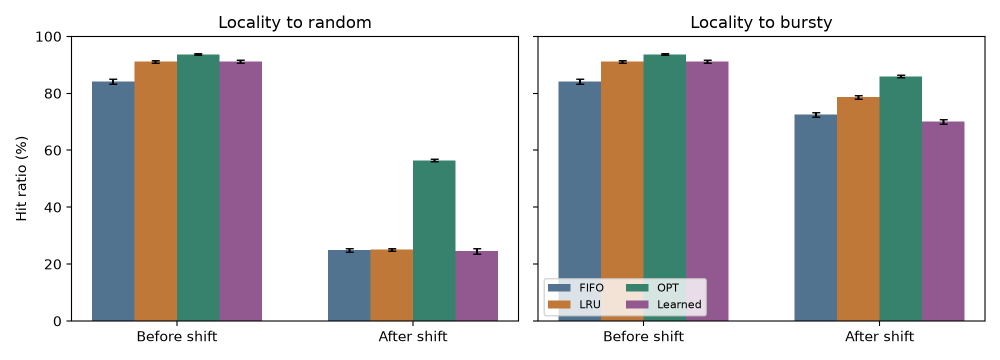
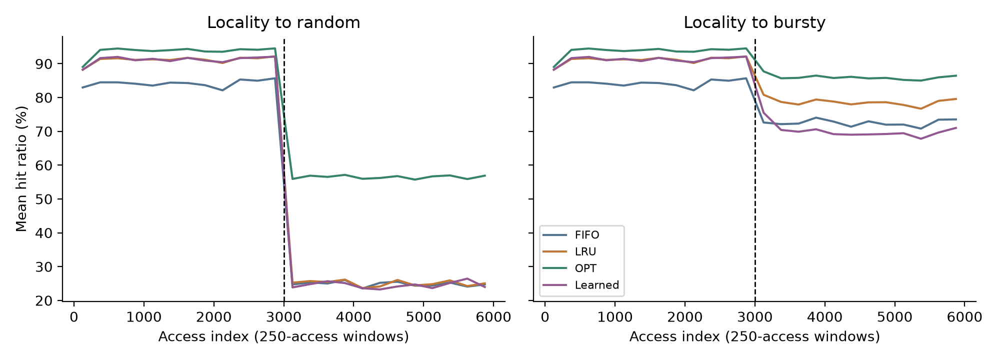
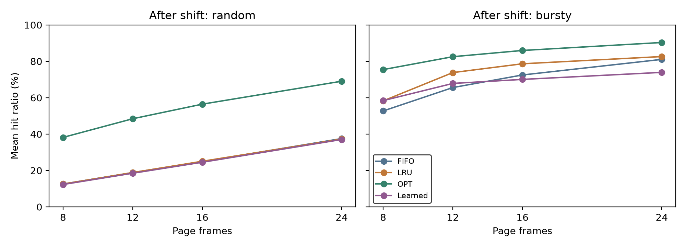

# Page Replacement under a Changing Access Pattern

**CSE-307 Operating Systems, Part B, Track 1**

Fahim Azmul Hasan | ID 202414014 | Section A | Level 3, Term 1

Submitted to Lecturer Khaled Hasan Irfan, CSE, MIST.

This Python project compares FIFO, LRU, Optimal, and a simple learned replacement
policy. It was run on Windows. Ubuntu and VMware are not needed. A page fault here
means the requested page is absent from the **simulated frames**; it is not a
measurement of Windows kernel paging.

## Run the project

Use Python 3.12. In PowerShell, from the repository folder:

```powershell
python -m venv .venv
.\.venv\Scripts\python.exe -m pip install -r requirements.txt
.\.venv\Scripts\python.exe -m unittest -v test_algorithms
.\.venv\Scripts\python.exe experiment.py
```

On Linux/macOS, use `.venv/bin/python` instead of `.venv\Scripts\python.exe`.
Running the experiment regenerates the results and figures. It does not need an
external dataset or model API.

## What the experiment does

Each reference string has 6,000 accesses to pages 0–63. The first 3,000 mostly
repeat pages 0–7. The next 3,000 either select pages randomly or mostly use an
eight-page group that changes every 128 accesses. In the bursty case, 80% of
accesses select a page in the current group and 20% select from all pages.

Ten trials are used for each pattern, with 8, 12, 16, and 24 frames. Every policy
receives the same reference strings. Frames and access history are kept across
the change. All faults, including the initial faults, are counted.

The learned policy uses a small decision tree. It looks at how recently and how
often each page was used. Training uses eight separate repeating-pattern strings.
The future of those training strings supplies examples of good pages to replace.
**Future accesses from the final experiments are not inputs to the learned policy.**
The model is not retrained after the access pattern changes. Equal scores use LRU.

For exact reproduction, evaluation seeds are 100–109; training seeds are 0–7.
Training examples are gathered by running LRU with 8, 16, and 24 frames. The model
is `DecisionTreeClassifier(max_depth=5, min_samples_leaf=30,
class_weight='balanced', random_state=307)`. Its inputs are time since last use,
count in the preceding 64 references, and total historical count. All tied
furthest-next-use candidates are positive training examples. The scores rank
candidates; they are not claimed to be calibrated probabilities. Parameters were
fixed before interpreting the evaluation results.

## Results in simple terms

Average hit ratios at 16 frames:

| Policy | Before the change | After random accesses | After bursty accesses |
|---|---:|---:|---:|
| FIFO | 84.2% | 24.8% | 72.5% |
| LRU | 91.1% | 25.1% | 78.6% |
| Optimal | 93.6% | 56.5% | 86.0% |
| Learned | 91.1% | 24.5% | 70.1% |

LRU and the learned policy are nearly equal before the change. Random accesses
make past history less useful. With changing groups of frequently used pages,
LRU performs better than the learned policy. The learned model was trained on a
stable repeating group, so it does not handle the moving groups as effectively.
This result is retained rather than changing the experiment to favor learning.
Optimal knows the complete future string; its total faults provide a comparison
for the full string, rather than a practical online replacement rule.





## Paper and files

[Read the revised six-page paper](output/pdf/CSE307_Track1_Term_Paper.pdf).
It has **one separate cover page and five pages of content and references**.
The cover includes the official MIST logo. Tables have white cells and black
borders. The abstract gives a high-level overview without numerical results.
Explanations focus on paging, locality, working sets, and replacement policies.
There are five external references;
the decision tree is explained briefly because Track 1 requires it.

| File | Purpose |
|---|---|
| `experiment.py` | Generate strings, train the small model, run policies, and produce results |
| `test_algorithms.py` | Check the policies using short examples |
| `results/raw_metrics.csv` | Exact fault counts and hit ratios for each trial |
| `results/summary.csv` | Average results before and after the change |
| `results/traces/` | Saved training and experiment reference strings |
| `results/access_results.csv.gz` | Detailed hit/fault records |
| `results/tree.txt` | Readable rules learned by the tree |
| `paper.tex` | Editable LaTeX paper |
| `assets/mist-logo.png` | Official MIST logo used on the cover |
| `build_paper.py` | Regenerate the paper source from the result tables |
| `build_pdf.py` | Produce the PDF with Python |

Other files in `results/` preserve training examples, software versions, internal
checking information, and window-by-window results. Those technical checks are
not part of the simplified report. The six automated test methods passed, and
the saved results were checked for consistency. No experiments were changed for
the report revision; displayed averages are simply rounded for readability.

## Regenerate the report

```powershell
.\.venv\Scripts\python.exe -m pip install -r requirements-pdf.txt
.\.venv\Scripts\python.exe build_paper.py
.\.venv\Scripts\python.exe build_pdf.py
```

`paper.tex` contains its tables, chart coordinates, and references. Keep the
`assets/mist-logo.png` file alongside it in the same folder structure when
compiling. It can be compiled in a normal LaTeX environment with `pgfplots`.
The native
compiler in this environment failed with “Unable to find standard directories
for platform,” so LaTeX compilation remains unverified. The provided PDF uses
Python/ReportLab to render the same text, tables, and measured chart. All six PDF
pages were visually checked. No TeX distribution was installed.

The six-page format follows the student's request. It exceeds the page limits
in the supplied assignment brief and announcement.

## Sources and AI assistance

Sources are [OSTEP, Chapter 22](https://pages.cs.wisc.edu/~remzi/OSTEP/vm-beyondphys-policy.pdf),
[Cornell's page replacement lecture](https://www.cs.cornell.edu/courses/cs4410/2015su/lectures/lec15-replacement.html),
[Operating System Concepts, 10th edition](https://www.os-book.com/OS10/),
[scikit-learn's decision-tree documentation](https://scikit-learn.org/stable/modules/tree.html),
and [Competitive caching with machine learned advice](https://arxiv.org/abs/1802.05399).

The cover logo is the original PNG used by the [official MIST website](https://mist.ac.bd/),
downloaded from `https://mist.ac.bd/assets/30-q2kX7pZF.png`. Its proportions are
preserved. Logo provenance is documented here rather than included among the
paper's academic references.

AI assistance was used to generate code, design and execute the experiments,
analyze results, and draft and revise the paper. The results come from actual
executed simulations. The student must review, understand, and take responsibility
for the design, results, and analysis before submission, as required by the brief.
